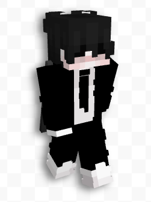
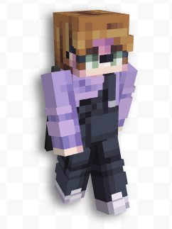
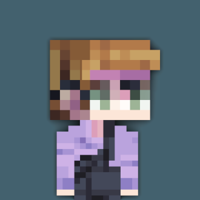

# minecraft-skin-render
Render your Minecraft skin into a nice profile picture

## Examples
These are a few examples of renders made by this project (skin, result):

 

 

 

# Running the script
First, install pillow. This is inside `requirements.txt`.
Then, change some options inside `render.py` and run it. You should have a file called result.png in (depending on some settings) anywhere from 0 seconds to ~10 seconds.

# Changable options
## SKIN_FILE
You should change this option. This is the file it grabs the skin from to generate the render.
## ARM_SIZE
Set this option to your skin arm size. Steve style is 4, Alex style is 3.
## BLUR
Change this option True if you want to use blurring for the skin on the background. This does make the render slower. False to disable.
## BACKGROUND_COLOR
Change this option to your preferred background color. It should be in RGB format.
## TOP_LAYER
This determines if the top layer of the skin should also be rendered (on the head). The top layer can overlap the skin in a bad way, but can also make it way nicer.

# Semi-changable options
## CANVAS_SIZE
This is the canvas size in pixels. Changing this shouldn't mess anything up, but it may.
## PIXEL_SIZE
This is the size of the pixels from the minecraft skin translated onto the canvas (FOR THE HEAD). Making the value inside bigger makes the actual pixels smaller and vice versa.
## BODY_PIXEL_SIZE
This does the same as PIXEL_SIZE, but for the body.
## TOP_LAYER_OFFSET
This is the offset for the top layer to be moved up. The default value is one PIXEL_SIZE, but it can be changed if it looks wrong

# Other options
You shouldn't need to change these. If you feel the need, and something is actually wrong with the script: please feel free to make a PR :).